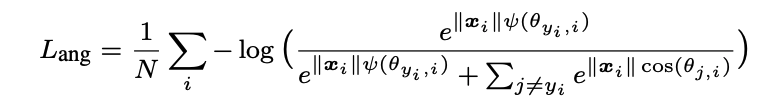
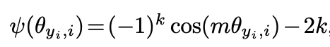
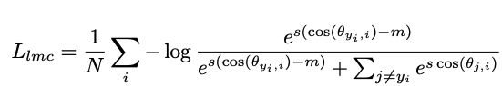
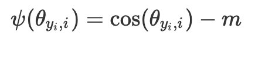
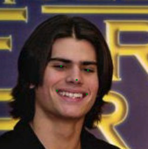
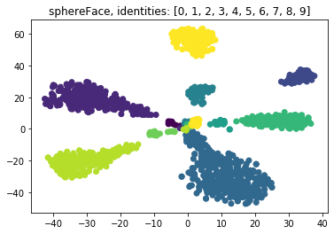

# Face Recognition 
This is a PyTorch implementation of [SphereFace](https://arxiv.org/abs/1704.08063) and [CosFace](https://arxiv.org/abs/1801.09414). Code modified from [sphereface_pytorch](https://github.com/clcarwin/sphereface_pytorch) and [mtcnn-pytorch](https://github.com/TropComplique/mtcnn-pytorch).

## Loss Functions
### SphereFace
SphereFace use the following loss function



### CosFace
CosFace use the following loss function



## Training
To train the model(s) on [CASIA dataset](https://paperswithcode.com/dataset/casia-webface), run this command:

```train
cd cosFace && python casia_train.py
cd sphereFace && python casia_train.py
```
## Generate Landmark with MTCNN


To generate facial landmarks using [MTCNN](https://github.com/TropComplique/mtcnn-pytorch), run this command:
```
cd mtcnn && python lfw_landmark.py --lfw /path/to/dataset
```

## Evaluation
To evaluate my model on [LFW dataset](http://vis-www.cs.umass.edu/lfw/), run:

```eval
cd cosFace && python lfw_eval.py --model /model/path --net faceNet --lfw /dataset/path
cd sphereFace && python lfw_eval.py --model /model/path --net faceNet --lfw /dataset/path
```

## Performance
Our model achieves the following performance on [LFW dataset](http://vis-www.cs.umass.edu/lfw/)

Model | Accuracy
:--:|:--:
SphereFace (pre-train)|0.9918
SphereFace (trained on CASIA from scratch)|0.9792
SphereFace (trained on CASIA from scratch)|0.9792
SphereFace (trained on CASIA from scratch, landmark generated by MTCNN)|0.9845
CosFace (trained on CASIA from scratch)|0.9872

## Feature Visualization with tSNE
Randomly choose 10 identities, multiple images per identity, from the CASIA dataset and visualize the feature representation using [tSNE](https://scikit-learn.org/stable/modules/generated/sklearn.manifold.TSNE.html).



## Reference
1. Liu, Weiyang. et al. "SphereFace: Deep Hypersphere Embedding for Face Recognition." [arXiv:1704.08063](https://arxiv.org/abs/1704.08063).
2. Wang, Hao. et al. "Cosface: Large margin cosine loss for deep face recognition." [arXiv:1801.09414](https://arxiv.org/abs/1801.09414).
3. Zhang, Kaipeng. et al. "Joint face detection and alignment usingmultitask cascaded convolutional networks." [arXiv:1604.02878](https://arxiv.org/abs/1604.02878)
4. [sphereface_pytorch](https://github.com/clcarwin/sphereface_pytorch)
5. [mtcnn-pytorch](https://github.com/TropComplique/mtcnn-pytorch)